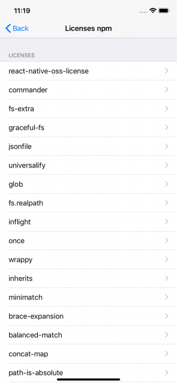
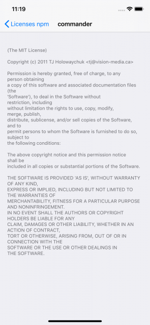
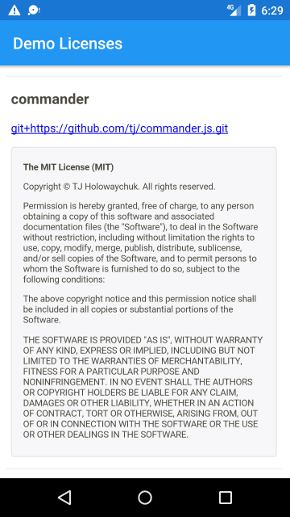
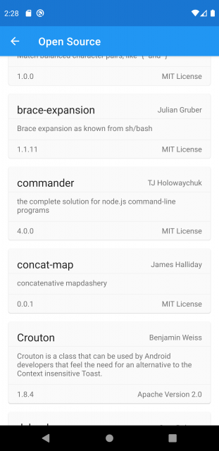

# react-native-oss-license
[](https://www.npmjs.com/package/react-native-oss-license)  
`react-native-oss-license` is **license list generator for React Native App(iOS & Android)**.  
It generates license lists of npm libraries for iOS, Android.  
This CLI tool allow you to easily generate content of oss-license.

## Installation
`npm i -g react-native-oss-license`

## [Sample App](https://github.com/k-tomoyasu/react-native-oss-license/tree/master/sample/) 

## Usage
### iOS
`react-native-oss-license` generate `plist` that you can locate to `Settings.bundle`.  
Recommended to use with [LicensePlist](https://github.com/mono0926/LicensePlist) that scan cocoaopds, carthage.  
You can merge output `react-native-oss-license` and `LicensePlist`.

### Android
It is assumed to be used with other tools.

#### LicenseToolsPlugin
[License Tools Plugin for Android](https://github.com/cookpad/LicenseToolsPlugin) is Gradle plugin to check library licenses and generate license pages.  
It generate license list in YAML format.  
`react-native-oss-license` generate same format content. You can merge results.

#### AboutLibraries
[AboutLibraries](https://github.com/mikepenz/AboutLibraries) provides fragment/activity that show license list.  
`react-native-oss-license` generate string resource xml `AboutLibraries` use.  
run `react-native-oss-license --format about-libraries`, output strings.xml that you can put into `res/values/`.  
and output stdout `withLibraries("package_name_A", "package_name_B" ...)` that pass to method `withLibraries`.

### CLI
```sh
> cd {project-root}
> react-native-oss-license --help
Usage: react-native-oss-license [options]

Options:
  -f, --format <format>       require output format. options:[settings-bundle,license-tools-plugin,about-libraries]
  --dev                       include devDependencies (default: false)
  --depth <depth>             dependencies depth (default: null)
  --output-path <outputPath>  specify path where output file (default: "default path")
  --json                      output json to stdout (default: false)
  --add-version-number        write library version number (default: false)
  --only-direct-dependency    output only dependencies you write packages.json. (default: false)
  --version                   show current version
  -h, --help                  output usage information

> react-native-oss-license --format settings-bundle
output settings-bundle format to 'ios/com.k-tomoyasu.react-native-oss-license.Output'
```

## screen-shots
### iOS



### Android
#### license-tools-plugin


#### AboutLibraries


## Acknowledgment
This is based on [dart-oss-licenses](https://github.com/ko2ic/dart_oss_licensesA) consepts.  
And referred [license-list](https://github.com/yami-beta/license-list).
